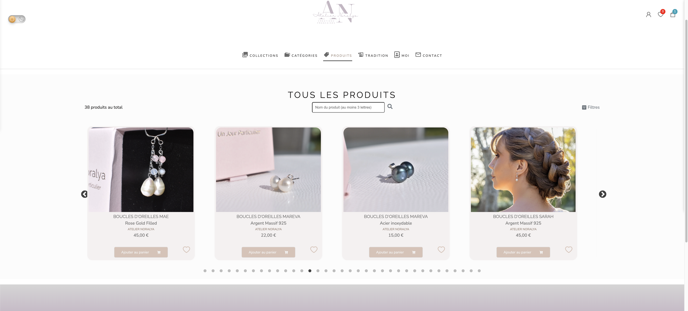
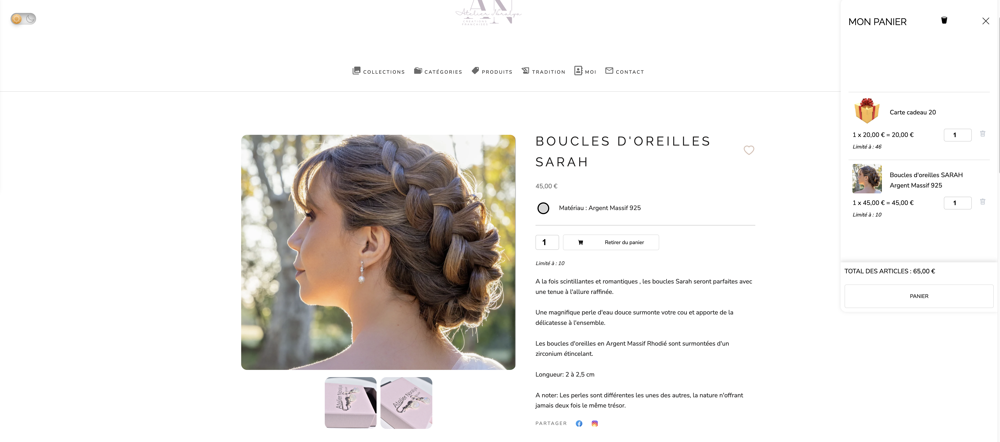
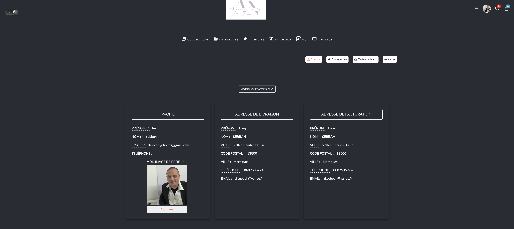
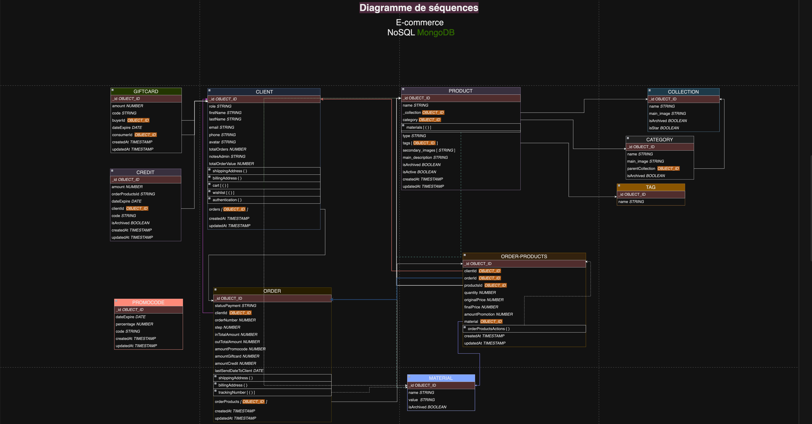

# Atelier Noralya - E-commerce de Bijoux Artisanaux

## Description

Atelier Noralya est une boutique en ligne dédiée à la vente de bijoux artisanaux spécialement conçus pour les mariages. Que vous soyez une mariée ou une demoiselle d'honneur, notre collection offre une variété de bijoux uniques pour rendre votre journée spéciale encore plus mémorable.

## Table des matières

1. [Fonctionnalités](#fonctionnalités)
2. [Technologies Utilisées](#technologies-utilisées)
3. [Installation](#installation)
4. [Utilisation](#utilisation)
5. [Captures d'Écran](#captures-décran)
6. [Contact](#contact)

## Fonctionnalités

### Pour les Utilisateurs

- **Navigation du Site** : Visitez librement notre site pour explorer nos produits.
- **Inscription et Connexion** : Créez un compte pour effectuer des achats et gérer vos commandes.
- **Dashboard Client** :
  - Consultez vos commandes passées, expédiées et en cours.
  - Effectuez des retours de produits avec numéro de suivi.
  - Suivez les envois de vos achats avec le numéro de suivi fourni par le vendeur.
  - Achetez et offrez des cartes cadeaux avec des codes numériques secrets.
  - Bénéficiez de codes promo et d'avoirs commerciaux.
  - Modifiez votre profil, adresse de livraison, facturation et coordonnées.
  - Consultez vos avoirs et cartes cadeaux.

### Pour les Administrateurs

- **Gestion des Clients et Commandes** :
  - Voir la liste de tous les clients et leurs commandes.
  - Actionner des workflows de commande et informer les clients.
- **Gestion des Produits** :
  - Créer et gérer des fiches produits, télécharger des images.
  - Émettre des promotions et badges de nouveauté.
  - Gérer les déclinaisons de produits avec prix, stock et promotions.
- **Gestion des Codes Promo et Statistiques** :
  - Créer des codes promotionnels.
  - Consulter les statistiques des ventes, échanges, remboursements, avoirs, cartes cadeaux, produits les plus vendus, et balance financière.
  - Suivre l'espace de stockage d'images sur Firebase Storage avec une progress bar.

## Technologies Utilisées

- **Frontend** :
  - React avec React Router pour la navigation
  - Redux Toolkit pour la gestion de l'état
  - Toastify pour les notifications

- **Backend** :
  - Node.js avec Express pour le serveur
  - Mongoose pour la gestion de MongoDB

- **Autres Technologies** :
  - Firebase Hosting pour l'hébergement
  - Firebase Functions pour les fonctions backend
  - Firebase Storage pour le stockage des images
  - EmailJS pour le formulaire de contact
  - Stripe pour les paiements

## Installation

### Prérequis

- Node.js (version 18 ou supérieure)
- npm (version 6 ou supérieure)
- Compte Firebase avec projet configuré
- Clé API Stripe

### Étapes d'Installation

1. **Clonez le dépôt :**
   ```bash
   git clone https://github.com/DavyHayehoudi/atelier-noralya.git
   cd atelier-noralya

2. **Installez les dépendances :**
   ```bash
   npm install
3. **Configuration Firebase :**  
Créez un fichier .env à la racine du projet et ajoutez les configurations Firebase :  
  ```bash 
REACT_APP_FIREBASE_API_KEY=your-firebase-api-key 
REACT_APP_FIREBASE_AUTH_DOMAIN=your-firebase-auth-domain
REACT_APP_FIREBASE_PROJECT_ID=your-firebase-project-id
REACT_APP_FIREBASE_STORAGE_BUCKET=your-firebase-storage-bucket
REACT_APP_FIREBASE_MESSAGING_SENDER_ID=your-firebase-messaging-sender-id
REACT_APP_FIREBASE_APP_ID=your-firebase-app-id 
```

4. **Configuration Stripe :**  
Ajoutez votre clé API Stripe dans le fichier .env :
```bash
REACT_APP_STRIPE_PUBLIC_KEY=your-stripe-public-key
```

5. **Démarrez l'application :**  
```bash 
npm start
```

6. **Déploiement sur Firebase :**  
- Assurez-vous d'avoir l'outil CLI Firebase installé :
```bash
npm install -g firebase-tools
```
- Connectez-vous à Firebase :
```bash
firebase login
```
- Initialisez Firebase dans le projet :
```bash
firebase init
```
- Déployez l'application :
```bash
firebase deploy
```

## Utilisation

### Inscription et Connexion

1. Visitez la [page d'inscription](https://noralyapreprod.web.app/account/register).
2. Créez un compte en suivant les instructions.
3. Connectez-vous pour accéder à votre dashboard client.

### Achat de Produits

1. Parcourez notre [collection de bijoux](https://noralyapreprod.web.app/menu-tab-collections).
2. Ajoutez des articles à votre panier.
3. Passez à la caisse et effectuez le paiement via Stripe.

### Gestion du Profil et des Commandes

1. Accédez à votre [dashboard](https://noralyapreprod.web.app/account).
2. Gérez vos commandes, adresse, et profil.
3. Consultez vos avoirs et cartes cadeaux.

## Captures d'Écran

### Page produits


### Master produit


### Dashboard Client


### Diagramme de Séquence


## Contact

Pour toute question ou assistance, veuillez nous contacter :

- **Support Client** : [support@ateliernoralya.com](mailto:support@ateliernoralya.com)
- **Paiements** : [payment@ateliernoralya.com](mailto:payment@ateliernoralya.com)
- **Formulaire de Contact** : Utilisez le formulaire de contact sur notre site ou envoyez un email à [contact@ateliernoralya.com](mailto:contact@ateliernoralya.com)

Merci de votre visite et bonne navigation sur Atelier Noralya !